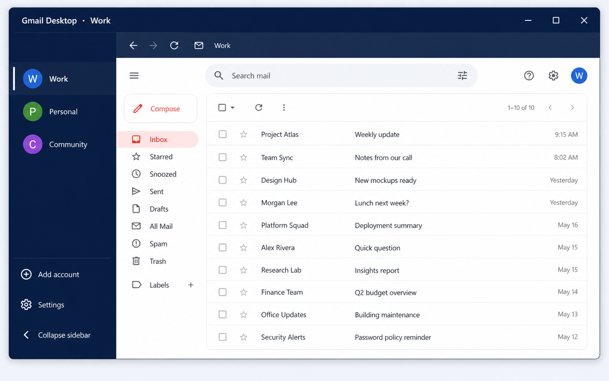
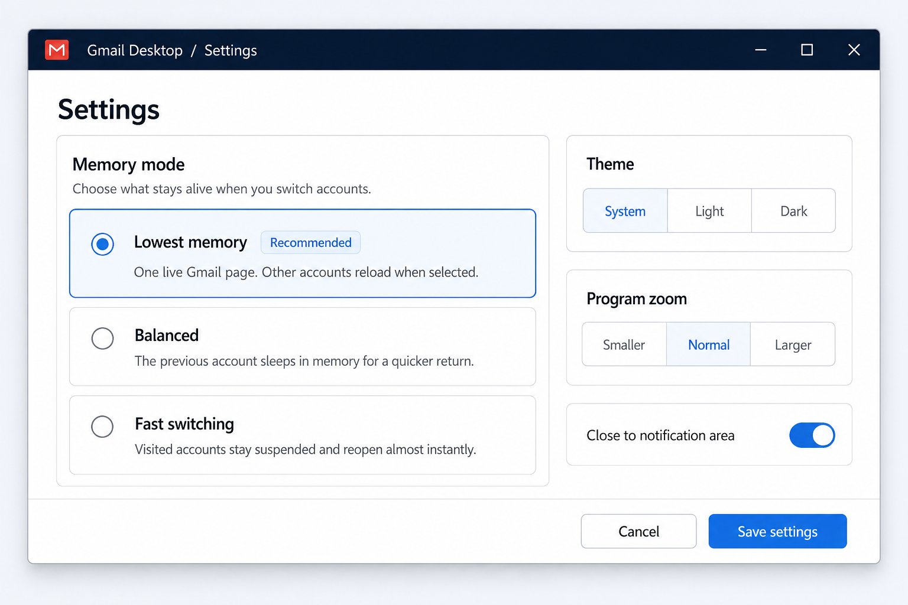

# Gmail Desktop

**Your Gmail accounts in one lightweight Windows app, without keeping a pile of tabs alive.**


Gmail Desktop is a small, native WPF shell around the normal Gmail website. Each account gets its own isolated, persistent WebView2 profile, while configurable memory modes control how many Gmail pages stay loaded.



*Illustrative mockup with fictional inbox data. Exact Gmail appearance may vary.*

## Why it uses less memory

**Lowest memory** is the default. When you switch accounts, Gmail Desktop disposes the previous WebView instead of leaving another full Gmail tab running. Cookies and sign-in state remain in that account's local profile, so switching back reloads Gmail without requiring another sign-in.


| Mode                            | What stays loaded                                                | Best for                                    |
| ------------------------------- | ---------------------------------------------------------------- | ------------------------------------------- |
| **Lowest memory** (recommended) | One live Gmail page                                              | The smallest memory footprint               |
| **Balanced**                    | The current and previous accounts; the previous one is suspended | Quicker switching between two accounts      |
| **Fast switching**              | Previously visited accounts, suspended while inactive            | The quickest switching across many accounts |


Suspension pauses timers and animations and lowers the inactive renderer's memory target. Gmail Desktop does not add background inbox polling or notification workers of its own.



*Choose the tradeoff between the smallest footprint and faster account switching.*

## Highlights

- **Multiple accounts, cleanly separated** — every account has an independent, persistent Gmail login and browser profile. Number of accounts logged in is not limited by Google.
- **Fast account switching** — use the sidebar or press Alt+1 through Alt+9.
- **Profiles that feel personal** — rename, recolor, reorder, and optionally show the Gmail profile photo for each account.
- **A focused native shell** — back, refresh, and inbox controls; collapsible sidebar; system, light, and dark themes; adjustable program zoom.
- **Windows-friendly behavior** — optional close-to-notification-area mode and single-instance protection.
- **Sensible link handling** — Gmail pop-ups remain in the account view, downloads use the normal WebView2 flow, and external links open in the default browser.
- **Session continuity** — the selected account and its last Gmail URL are remembered between launches.


## Privacy and security

Google credentials are entered only on Google's HTTPS pages inside WebView2. Gmail Desktop does not request, read, or store passwords, and WebView2 password saving and form autofill are disabled.

Local browser profiles are stored under `%LOCALAPPDATA%\GmailDesktop\Profiles`. Account metadata, the optional Google-hosted avatar URL, and app preferences are encrypted for the current Windows user with DPAPI in `%LOCALAPPDATA%\GmailDesktop\settings.dat`.

See [SECURITY.md](SECURITY.md) for the full security model, implemented hardening, and the limits of protection on a compromised Windows account.

## Requirements

- Windows 10 or Windows 11
- [.NET 10 Desktop Runtime](https://dotnet.microsoft.com/download/dotnet/10.0)
- [Microsoft Edge WebView2 Runtime](https://developer.microsoft.com/microsoft-edge/webview2/)

WebView2 is already installed on most current Windows systems. The included publish profile targets 64-bit Windows.

## Install

Download the `gmail-desktop-v*-windows-x64.exe` installer from the latest GitHub release and run it. The installer works per user, requires no administrator access, and places Gmail Desktop in `%LOCALAPPDATA%\Programs\Gmail Desktop`.

Starting with version 1.1.0, releases use an installer instead of a standalone portable executable. Gmail Desktop depends on the native `WebView2Loader.dll`. When that DLL was embedded in the old single-file build, .NET extracted it under `%TEMP%`, where Windows or another cleanup utility could delete it while the app was still running and cause a later “DLL was not found” crash. The installer keeps the loader beside the application in its stable installation directory.

## Build and run

Clone the repository, then run:

```powershell
dotnet restore
dotnet run
```

Create a release build with:

```powershell
dotnet publish -p:PublishProfile=Windows-x64
```

The published app is written to `bin\Release\publish`.

To build the single-file installer after publishing, install [Inno Setup](https://jrsoftware.org/isinfo.php) and run:

```powershell
ISCC.exe installer.iss
```

## Removing an account

Removing an account deletes only that app profile's local cookies and browser data. It does not delete or modify the Google account itself.

---

Gmail Desktop is an independent, unofficial application and is not affiliated with or endorsed by Google. Gmail is a trademark of Google LLC.
